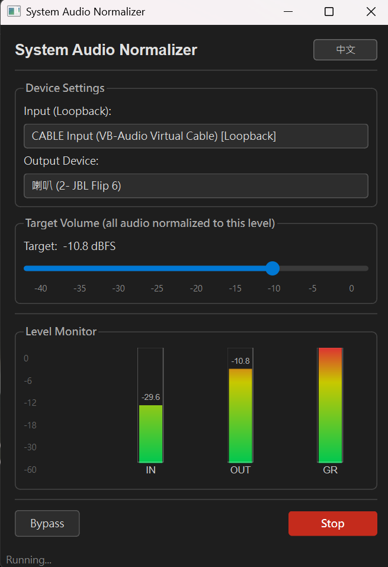

# Unified Volume — System Audio Normalizer

A lightweight Windows desktop app that captures system audio via WASAPI loopback, normalizes the volume to a fixed target level, and routes the output to any audio device (including VB-Cable).



---

## Requirements

- Windows 10/11
- Python 3.10+
- [VB-Cable](https://vb-audio.com/Cable/) (optional, recommended for routing normalized audio to other apps)

---

## Installation

```bash
# 1. Clone the repo
git clone [<repo-url>](https://github.com/jASON-6969/Unified_volume.git)
cd Unified_volume

# 2. Install dependencies
pip install -r audio_normalizer/requirements.txt
```

> `pyaudiowpatch` requires the Microsoft C++ Build Tools on some machines.  
> If the install fails, grab the wheel directly from https://github.com/s0d3s/PyAudioWPatch/releases

---

## Start

```bash
python audio_normalizer/main.py
```

1. Select a **Loopback Device** — this is the audio source (e.g. your speakers/headphones loopback).
2. Select an **Output Device** — where the normalized audio is sent (e.g. `CABLE Input [VB-Cable]`).
3. Adjust the **target level** (dBFS) with the slider.
4. Click **Start** to begin normalization.

Use **Bypass** to pass audio through without any gain adjustment.

---

## How it works

The engine (`audio_engine.py`) reads audio chunks from a WASAPI loopback stream, computes the RMS level, and applies a gain so the output matches the target dBFS. A hard clip at 0 dBFS and a +20 dB gain ceiling prevent distortion.
